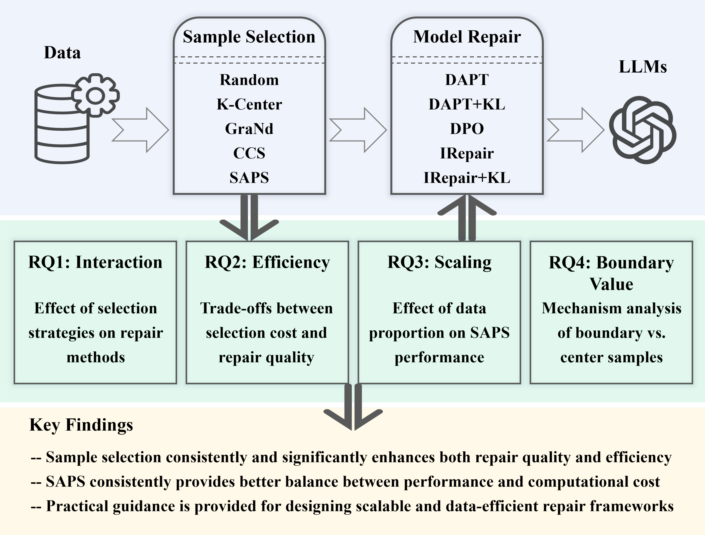

# SAPS
Code Replication for "An Empirical Study of Sample Selection Strategies for Large Language Model Repair"

This repository contains code related to the paper _An Empirical Study of Sample Selection Strategies for Large Language Model Repair_. The framework is shown as follows:

## Process of SAPS

(a) Embedding Extraction, where input samples are mapped into semantic embedding vectors using a fixed pre-trained encoder, ensuring model-agnostic prioritization; 

(b) Representation Structuring, where embeddings are reduced in dimensionality and clustered to uncover coarse-grained semantic structures;

(c) Boundary-Aware Sampling, which selects peripheral samples within each cluster to capture semantic boundaries and preserve informative diversity. The resulting prioritized dataset balances efficiency and representativeness for downstream model repair.

The framework is shown as follows:

## How to start quickly 
To quickly reproduce the repair experiments:

1. Install all required dependencies using `pip install -r requirements.txt`.

2. Download the [Wikitext-2 (raw)](https://huggingface.co/datasets/Salesforce/wikitext#wikitext-2-raw-v1-1) and [Lambada](https://huggingface.co/datasets/cimec/lambada) datasets, and place them under `transformer_utils/irepair/data/intervene_data/`. All other datasets are already included in the repository and originate from [ajyl/dpo_toxic](https://github.com/ajyl/dpo_toxic) and [allenai/real-toxicity-prompts](https://huggingface.co/datasets/allenai/real-toxicity-prompts).

3. After preparing the data, run `python transformer_utils/sample_selection/selection/Calculate_Scores.py` to obtain data selection results, where the training set size is determined by the number of samples used for full repair with a fixed random seed.

4. Finally, execute `bash transformer_utils/irepair/toxicity/run_repair.sh` to perform the model repair process. The repair procedure will automatically start, and the results will be stored in the corresponding output directories.
   

## Acknowledgement
We thank the implementation of [ajyl/dpo_toxic](https://github.com/ajyl/dpo_toxic) and [IRepair](https://huggingface.co/datasets/Anonymous007/IRepair)), which inspires some code in this repo.
